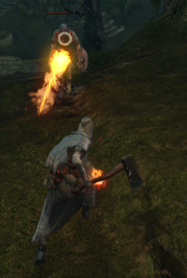
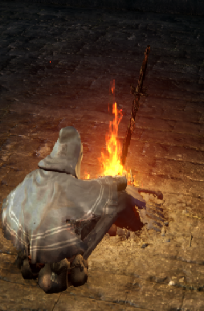

# Dark Souls
## Учасник команди: 
> Процап Дмитрій

## Гра
> Dark Souls: Remastered

## Жанр:
> Action-RPG

## Опис:

### *Головна мета гри:*

Продовжити епоху полум'я або почати епоху темряви

### *Бойова система:*
У грі наявні декілька типів фізичного урону, магія та елементальний урон, у зброї є різні здібності, які можна використовувати, броня та щити мають унікальні показники захисту від різних типів урону.

### *Система багать:*
Гравець зберігає свій прогрес, відпочиваючи біля багать, де він може ремонтувати та покращувати своє спорядження та покращувати свої навички, при смерті гравець повертається на остання відвідане багаття, при кожному відпочинку вороги відроджуються(крім босів) 

### *Локації:*
Локації нелінійні, поділені на секції, є велика кількість дверей, ліфтів, потаємних шляхів, які відкривають короткий шлях до багаття чи до нової локації, на більшості локацій є торгівці, у яких можна придбати різноманітні предмети та спорядження.

### *Система ворогів:*
Існує велике різноманіття типів ворогів, солдати, чудовиська, тварини та міфічні істоти, та боси, унікальні вороги, які знаходяться у кожній локації та виступають бар'єром між локаціями, перевіряючи навички та наполегливість гравця.

### *Система покращення навичок та спорядження:*
 у якості ігрової валюти тут використовуються душі, які гравець заробляє, вбиваючи ворогів та долаючи босів, душі можна використовувати для покращення спорядження, покупки новий речей у торгівців або створення унікальної зброї у ковалів. При смерті гравець втрачає душі, але він може їх забрати, прийшовши на місце втрати, при повторнії смерті душі вже неможливо забрати.

---
[Повернутися до основної сторінки](../README.md)