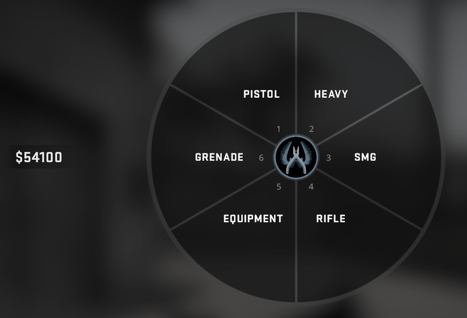
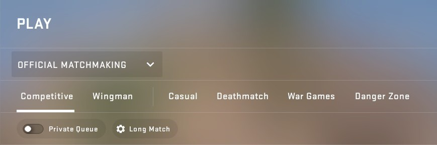

# Counter-Strike: Global Offensive
## Учасник команди: 
Перекупка А.В.

## Жанр:
Тактичний шутер, FPS (шутер від першої особи)

## Опис:
*Опис сценарію гри:*  
Кожна з двох команд грає за одну з сторін (контр-терористи та терористи). Ціль терористів встановити бомбу та підірвати її або знешкодити усю команду суперника. Ціль спецвійськ знешкодити  команду терористів до встановки бомби або розмінувати її до моменту її підриву.

### *Ігрові правила:* 
1. Перед матчем вибирається певна карта (локація) на  якій буде проходити протистояння.
2. 2 команди з 5 людей починають грати за одну з двох сторін (хто за яку сторону починає визначається зазвичай рандомом або спеціальним ножовим раундом ( де кожен гравець немає жодної зброї, окрім ножа), також при іноді це відбувається за домовленістю).
3. Гра зазвичай йде до 30 раундів. Перемагає та команда, яка перша набрала 16 раундів. Кожний раунд розігрується основний сценарій гри. При виконанні однієї з цілей тієї чи іншої сторони, очко віддається тій чи іншій команді. Після 15 раундів команди обов’язково міняються сторонами, зберігаючи поточний рахунок. Економіка при цьому відкатується до початкової.
Ціль гри: у класичному змагальному режимі: перемогти набравши першим 16 раундів. 

### *Переміщення гравця:*
Пересування гравця у грі схоже з переміщенням людини в реальному житті, здебільшого це переміщення по горизонтальній площині. Є можливість стрибків на певну висоту та  пересування вниз-вгору за допомогою драбини. Немає можливості лазити по стінах. 

### *Стрільба:* 
Механіка стрільби є досить важка у засвоєнні, через сильну віддачу та можливість стріляти в ціль тільки при повній зупинці (при русі напрямок пулі є непередбачуваним), що не дуже звично через постійне переміщення персонажів.

### *Зброя та знаряддя:*
 У грі присутні декілька класів зброї, кожна зброя має певну ціну і свої особливості. Також є додаткові допоміжні предмети такі як: бронежилет, каска, гранати (які є мають дуже великий вплив на гру), набір сапера.
 

### *Економіка:* 
У грі присутня ігрова економіка. Певна кількість грошей видається за перемогу або поразку в раунді або за інші ігрові досягнення (знешкодження суперника з певної зброї, знешкодження бомби або її встановлення та ін.). Максимальна кількість грошей це зазвичай 16000 доларів (ігрових), після накопичення, яких додаткові кошти не будуть надходити до моменту поки на рахунку не стане менше. На початку матчу та після зміни сторін кожному видається по 800 доларів. Всі наступні накопичення йдуть вже під час гри. Кошти видані за ігрові досягнення стабільні, а за раунд залежать від loss bonus (особливість економіки, завдяки якій команда отримує більше грошей, якщо програє кілька раундів підряд, зроблено для того, щоб зменшити ймовірність економічної домінації однієї команди над іншою.)

### *Карти:*
Є основний набір змагальних карт, які розробники оновлюють та міняють час від часу. В залежності від цього змінюється геймплей та незначні переваги однієї сторони над іншою. Також окрім основних 7 карт присутні і community карти, які час від часу додаються до гри. 

### *Ігрові режими:* 
Окрім основного вищезазначеного режиму (Competitive), в грі ще присутні й інші офіційні (2v2 Wingman, Danger Zone (Battle royale), War Games та ін.) та неофіційні режими (їх існує безліч та пограти в них можна на community серверах. Є як і міні-ігри типу Hide and Seek так і окремі карти для тренування ігрових скілів, налаштувань гри тощо).

---
[Повернутися до основної сторінки](../README.md)